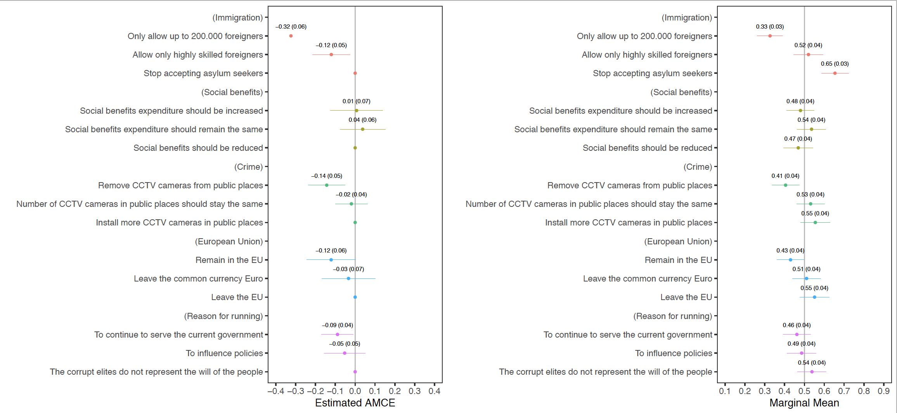

# Example of a conjoint survey experiment based on SoSci Survey platform

This repository consists of all necessary scripts for running a conjoint survey experiment on SoSci Survey, pre-processing, and the analysis in R.

Conjoint survey experiment helps to identify peoples' preferences over a particular object of interest in a multidimentional framework. For instance, when users decides to read a news article online, they might consider several features (dimensions) of the article before reading it. Let's say topic relevance (climate change, immigration, health care), credibility of the news source (established media, new digital born news web site), and partizanship (Republican or Democrat) are the only possible features of news articles. How can we identify what feature has the largest utility and what combination of features is the most desiable for users? Conjoint survey experiments can help to answer this kind of questions.

In this working example, respondents are suggested to choose between two hypothetical parties, which are running for a seat in a local parliament. Attributes and levels represent policy proposals.

## Generating conjoint design

[Conjoint Survey Design Tool](https://github.com/astrezhnev/conjointsdt) developed by Anton Strezhnev (NYU) can generate a conjoint design that will set a randomization algorithm based on predefined attributes and levels of object of interest. Here two parties have five attributes with three levels each. The output from conjointsdt is a PHP script.

  ## Embedding conjoint design into SoSci Survey
  
SoSci Survey is a survey platform that allows running a survey experiments free of charge if the project is made for academic purposes. After creating a survey project on the SoSci platform, the php script from conjointsdt goes to php field with important additions programmed by [Roberto Ulloa](https://github.com/robertour) (GESIS Leibnitz Institute of Social Sciences) below.


To make conjoint design to be distributed across all tasks this code whould go first:
```php
if (value('IV01_01')){
} else {

\\\ CONJOINT CODE GOES HERE

	put('IV01_01', json_encode($returnarray));
}
```

Randomized party attributes and levels combined with a HTML code for a table should appear in every conjoint task. If there are eight tasks, the following code should be added to every task:

```php
$task = 1;
$total_attributes = 6;

$error_message = '<h1>Error! Please let us know.</h1>';
$val = value('IV01_01');
if ($val){

	$returnarray = json_decode($val);

	$table = '';
	$header = '<tr><th></th><th>Party 1</th><th>Party 2</th></tr>';
	for ($i=1; $i<=$total_attributes ; $i++){
	$table .= '<tr><th>'.
	$returnarray['F-'.$task.'-'. $i].
	'</th><td>'.
	$returnarray['F-'.$task.'-1-'. $i].
	'</td><td>'.
	$returnarray['F-'.$task.'-2-'. $i].
	'</td></tr>';
	}
	html('<table border="4" cellpadding="10" cellspacing="0" >'.$header. $table . '</table>');

} else {
        html($error_message);
}
```
This will produce the following table across all tasks:


Conjoint on SciSci Survey is ready to be run through!

## Pre-processing 

SoSci Survey stores participants' responses in several formats including CSV format. Responses to classical survey questions are presented in straightforward way. The conjoint output, however, looks convoluted and make sence only pre-processing in R. Essentially, the output contains the information on attributes and levels a respondent saw on the screen: `F-1(task)-1(profile)-1(attribute)`. For instance, this is a two data points generated from one respondent:

`\"F-1-1\":\"Immigration\, \"F-1-1-1\":\"Allow up to 200,000 immigrants a year to come to the country",`

For this respondent, in Task 1, Attribute 1 took a value `Immigration`. Under Task 1, Profile 1, Attribute 1 took a level value `Allow up to 200,000 immigrants a year to come to the country`.

I wrote an R script with extensive notes that make collected data from conjoint survey experiment ready for analysis. See file `Conjoint_Pilot_Pre_Processing.R` in the repository. Once you save the pre-processed dataframe in a desirable format, the data is ready for conjoint analysis.

## Analysis

Following recent applications of conjoint survey experiment, for the pooled data, I estimate the average marginal component effect (AMCE) (see Hainmueller, Hopkins and Yamamoto 2014) and marginal means from Leeper, Hobolt and Tilley (2019) for comparison. Specifically, I use OLS to regress single choice outcomes on binary variables of attribute levels, where 1 indicates that a respondent saw that particular level while evaluating a candidate profile. For AMCE, one level in each attribute is omitted as a reference category, and standard errors will be clustered by respondent. A script for conjoint analysis is avaiable on [Thomas Leeper](https://github.com/leeper/conjoint-subgroups) github page. Leeper's script also contains code for making plot with `ggplot2`. Here is the result from the working example, where respondents choose between two parties with five attributes representing policy proposals:



## External validity

Recent debate over conjoint analysis external validity (Abramson, Kocak and Magazinnik, 2019) suggests that AMCE measures an average of respondents' ideal points rather than the most preferred policy proposal or candidate feature because the distribution of weights that respondents put on every attribute is not uniform. I will show how to address this issue with the method proposed in De La Cuesta, Egami and Imai (2019) soon.
